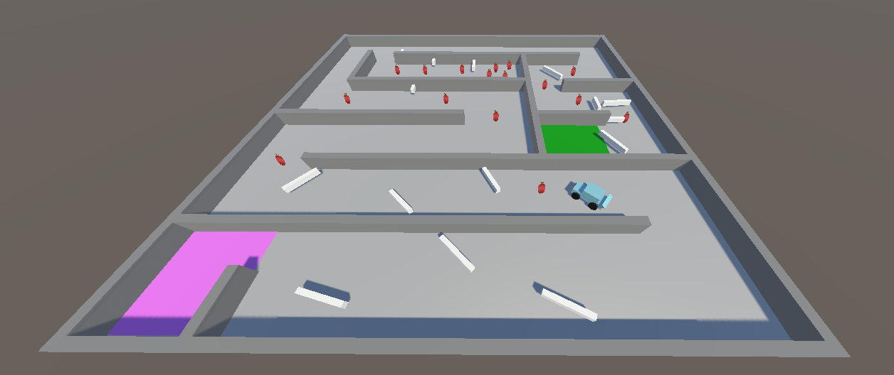

# A Unity project (for mobile) that consists of minigame prototypes

# Prototype 1 - Rocket Booster game:
Tapping Spacebar and turning left to right, avoid obstacles and reach the goal.

[RocketDemoVideo.webm](https://github.com/Redpanda-dev/Unity-Rocket-and-Car-game/assets/89864966/d2327284-1594-4fa4-a18d-d1bcb970b4d1)

# Prototype 2 - Car Game:
Drive through a Maze using WASD-keys and collect Apples and reach the goal

